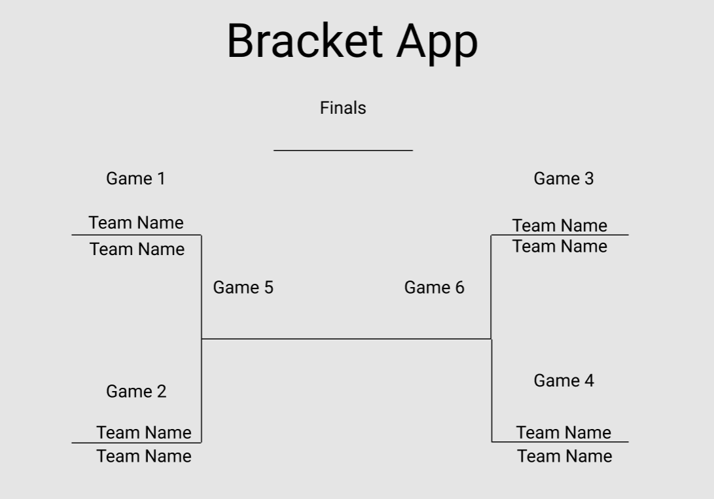
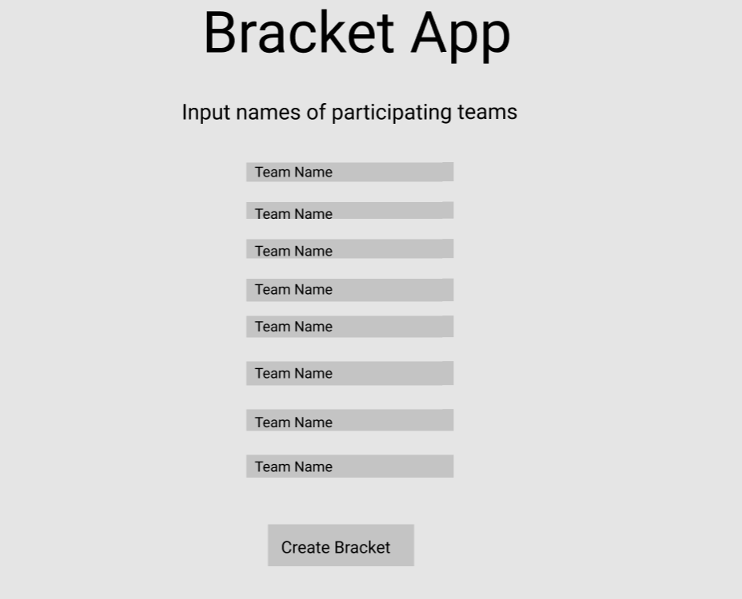
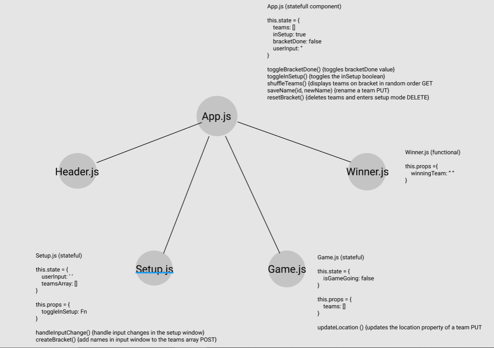

# Sports Bracket App
## Application Concepts and Wireframe
### Application Concepts
- This is a bracket made to keep track of the winners and losers of any 1-game elimination tournement
- I will not be using any established APIs
- Full CRUD 
  - GET: get team by ID
  - POST: teams will be posted on an array of competitors
  - PUT: change team names 
  - DELETE: clear teams array

### Functionality
- I want a header to display the name of my app
- When the app loads the user will be prompted to enter in the names of 8 teams
  - If I have extra time make option for user to choose size of tournement (4, 8, 16, or 32 teams)
- the location of each team will be randomly assigned to positions in the starting bracket(backend)
- Each game listing will have the names of both teams participating and buttons along side the team name to signify who is moving on
- when a winner of a game has been picked that team name will be advanced to the next spot on the bracket
- once an overall bracket winning has be determined, an animation displaying the winner will occur

### Endpoints
- GET: fetch teams array
- POST: push team to the list of contendors
- PUT: change team names
- PUT: change team bracket location
- DELETE: delete all teams in preparation for new bracket

### Component Architecture
- App.js (stateful: holds array of teams in bracket and if bracket setup is enabled)
  - Header.js (functional)
  - Setup.js (stateful: holds user inputs for axios request to post teams)
  - Game.js (stateful: holds information on if the game has been played)
  - Winner.js (functional)

### Wireframe 

